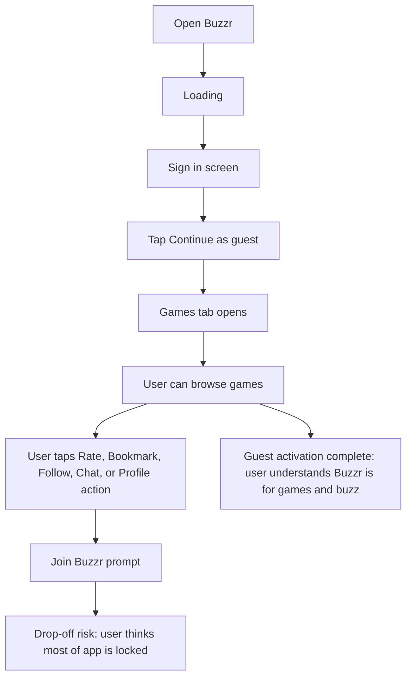

```mermaid
flowchart TD
  Start["Open Buzzr"]
  Loading["Loading"]
  SignIn["Sign in screen"]
  Guest["Tap Continue as guest"]
  Games["Games tab opens"]
  Explore["User can browse games"]
  BlockedAction["User taps Rate, Bookmark, Follow, Chat, or Profile action"]
  Join["Join Buzzr prompt"]
  Complete["Guest activation complete: user understands Buzzr is for games and buzz"]
  Drop["Drop-off risk: user thinks most of app is locked"]

  Start --> Loading --> SignIn --> Guest --> Games --> Explore --> Complete
  Explore --> BlockedAction --> Join --> Drop
```
